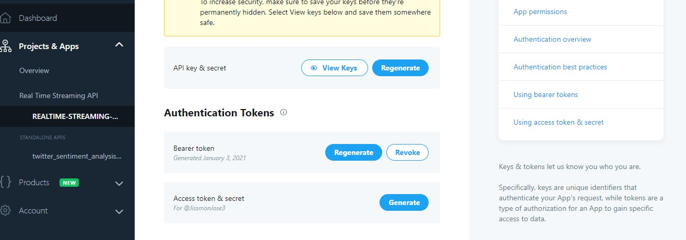

# Twitter Real Time Streaming API

- get the tweets in realtime. and filter them using certain queries.

1.  Log in to twitter developer account. Create an app and API keys and tokens.

    

2.  Create package.json file

    ```zsh
    npm init -y
    ```

3.  Install _express_, _socket.io_, _needle_ which is the html client, _dotenv_ to set environment variables, _nodemon_ as dev dependency.

    ```zsh
    npm i express socket.io dotenv needle
    npm i nodemon -D
    ```

4.  Update the scripts in _package.json_.

    **package.json**

    ```json
     "scripts": {
        "start": "node server/index",
        "dev": "nodemon server/index"
        }
    ```

5.  Create _server/index.js_ , also create _.env_ in root folder.

6.  Paste bearer token to a variable in _.env_

7.  Require below packages.

    **index.js**

    ```js
    const needle = require('needle');
    const config = require('dotenv').config();
    const TOKEN = process.env.TWITTER_BEARER_TOKEN;
    ```

8.  Set Api reference

    https://developer.twitter.com/en/docs/api-reference-index

    ```js
    const rulesURL = 'https://api.twitter.com/2/tweets/search/stream/rules';

    const streamURL =
      'https://api.twitter.com/2/tweets/search/stream?tweet.field= public_metrics&expansions=author.id';
    ```

9.  Add Rules - Look for tweets that have keyword _giveaway_.

    ```js
    const rules = [{ values: 'giveaway' }];
    ```

10. Get Rules

        ```js
        // get stream rules

        async function getRules() {
          const response = await needle('get', rulesURL, {
            headers: {
              Authorization: `Bearer ${TOKEN}`,
            },
          });
          console.log(response.body);
          return response.body;
        }
        (async() => {
            let currentRules;
            try {
                currentRules = await getRules();
            } catch (error) {
                console.error(error);
                process.exit(1);
            }
        })()

        ```

11.
